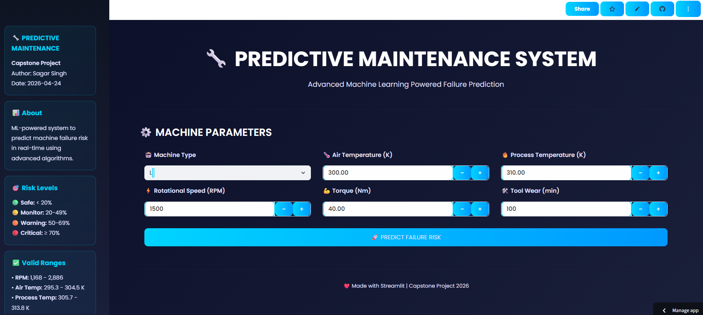

# Predictive Maintenance using Machine Learning on Sensor-Based Industrial Data

[](https://predictive-maintenance-h7fcagn3g3u8pzfc6wbcjm.streamlit.app/)

## 📸 Screenshots

### 1️⃣ Streamlit App



## 📋 Overview

This project develops a machine learning classification model to predict machine failures based on real-time sensor data. Predictive maintenance is critical in modern industries as it enables early detection of potential failures, reducing downtime, improving operational efficiency, and minimizing maintenance costs.

## 🎯 Problem Statement

Unexpected machine failures lead to:
- Production downtime
- Increased maintenance costs
- Operational inefficiencies

The goal is to build a machine learning model that predicts whether a machine will fail (Target = 1) or not (Target = 0) using historical sensor and operational data, enabling early detection and proactive maintenance strategies.

## 📊 Dataset Overview

- **Records:** 10,000 rows
- **Features:** 9 columns
- **Problem Type:** Supervised binary classification

### Data Dictionary

| Column Name | Description | Data Type |
|---|---|---|
| UDI | Unique identifier for each machine record | Integer (ID) |
| Product ID | Identifier for machine product category | String (Alphanumeric) |
| Type | Machine type: Low (L), Medium (M), High (H) | Categorical |
| Air temperature [K] | Temperature of surrounding air (in Kelvin) | Float (Continuous) |
| Process temperature [K] | Temperature during manufacturing process | Float (Continuous) |
| Rotational speed [rpm] | Machine rotational speed (revolutions per minute) | Integer (Continuous) |
| Torque [Nm] | Torque generated by machine (Newton-meters) | Float (Continuous) |
| Tool wear [min] | Tool usage duration (in minutes) | Integer (Continuous) |
| Target | Machine failure indicator (0 = No Failure, 1 = Failure) | Binary (0/1) |

## 🔍 Key Insights from EDA

- **Class Imbalance:** The dataset is highly imbalanced with only ~3.39% failure cases
- **Feature Correlations:** 
  - Torque has the strongest correlation with machine failure (0.19)
  - Tool wear shows moderate positive correlation (0.10)
  - Strong inverse relationship between rotational speed and torque (-0.87)
- **No Missing Values:** Dataset is clean with no null values or duplicates
- **Feature Engineering:** Engineered features (power, temp_diff) show improved correlation with target

## 🛠️ Tools & Libraries Used

- **Data Manipulation:** Pandas, NumPy
- **Data Visualization:** Matplotlib, Seaborn
- **Machine Learning:** Scikit-learn, XGBoost
- **Deployment:** Streamlit
- **File Format:** Jupyter Notebook

## 📈 Project Workflow

1. **Data Understanding & Cleaning**
   - Dataset exploration and structure analysis
   - Missing value and duplicate detection
   - Data type validation

2. **Exploratory Data Analysis (EDA)**
   - Distribution analysis
   - Outlier detection
   - Correlation analysis
   - Feature relationships visualization

3. **Feature Engineering**
   - Power (derived from torque and rotational speed)
   - Temperature difference (process - air temperature)
   - Feature scaling and encoding

4. **Model Building**
   - Baseline model development
   - Hyperparameter tuning
   - Threshold optimization
   - SMOTE-based imbalance handling

5. **Ensemble Methods**
   - Voting Classifier
   - Stacking Classifier

6. **Model Evaluation & Comparison**
   - Performance metrics analysis
   - Feature importance visualization
   - Final model selection

7. **Deployment**
   - Streamlit application development

## 🤖 Models Evaluated

### Individual Models (Baseline)
- Logistic Regression
- Decision Tree
- Random Forest
- Gradient Boosting
- XGBoost
- AdaBoost
- Support Vector Machine (SVM)
- K-Nearest Neighbors (KNN)

### Results Summary

| Model | Test Precision | Test Recall | Test F1 Score |
|---|---|---|---|
| Logistic Regression | 0.45 | 0.65 | 0.53 |
| Random Forest (Tuned) | 0.89 | 0.82 | 0.85 |
| Gradient Boosting (Tuned) | 0.95 | 0.81 | 0.87 |
| XGBoost (Tuned) | 0.82 | 0.82 | 0.82 |
| **Voting Ensemble** | **0.95** | **0.82** | **0.88** |
| Stacking Ensemble | 0.41 | 0.93 | 0.57 |

## 🏆 Final Model: Voting Classifier

### Why Voting Classifier?

- Provides the best balance between precision and recall
- More stable compared to individual models
- Performs better than stacking (which had excessive false positives)
- Better suited for handling imbalanced data

### Model Performance

- **Precision:** 0.95 (very few false alarms)
- **Recall:** 0.82 (detects most failures)
- **F1 Score:** 0.88 (strong overall balance)
- **Confusion Matrix:** 3 FP, 12 FN

### Feature Importance (Top 5)

1. **Torque [Nm]** (0.20) - Strongest failure predictor
2. **Rotational speed [rpm]** (0.19) - Critical mechanical parameter
3. **Power [kW]** (0.16) - Engineered feature showing effectiveness
4. **Tool wear [min]** (0.16) - Usage duration impact
5. **Temperature difference [K]** (0.09) - Operational condition indicator

## 💡 Business Impact

The deployment of this model provides significant business benefits:

- **Early Failure Detection:** Identifies machines at risk before breakdown
- **Reduced Downtime:** Enables proactive maintenance instead of reactive repairs
- **Cost Savings:** Prevents expensive emergency maintenance and production loss
- **Improved Operational Efficiency:** Optimizes maintenance scheduling and resource allocation
- **Data-Driven Decision Making:** Uses sensor data to guide maintenance strategies

**Transition Goal:** Reactive Maintenance → Predictive Maintenance

## 🌍 Real-World Applications

- Manufacturing plants
- Automotive industry
- Heavy machinery operations
- Smart factories (Industry 4.0)
- IoT-based monitoring systems
- Any industry relying on continuous machine operation

## 🚀 Deployment Strategy

The model is deployed as a Streamlit application where users can:

1. **Input machine parameters** (temperature, torque, speed, tool wear, etc.)
2. **Process data** using the trained preprocessing pipeline
3. **Receive predictions** on machine failure probability
4. **Get actionable insights** based on defined thresholds

### How to Use

```python
# Example prediction workflow
import joblib

# Load the trained model
model_data = joblib.load("voting_model.pkl")
model = model_data["model"]
threshold = model_data["threshold"]

# Prepare input features
# Make prediction
prediction = model.predict(features)

# Apply threshold
failure_risk = "High Risk" if prediction >= threshold else "Normal"
```

## 📚 Model Trade-offs

In predictive maintenance, there's an important balance:

- **False Negatives (Missed failures)** → Very costly, compromises safety
- **False Positives (False alarms)** → Manageable, increases maintenance cost

The Voting Classifier optimizes this balance by:
- Minimizing missed failures (82% recall)
- Keeping false alarms within acceptable limits (95% precision)

## 📊 Performance Comparison

### Individual vs. Ensemble

- **Individual Models:** Varied performance with trade-offs
- **Stacking:** High recall (0.93) but excessive false positives
- **Voting:** Balanced precision (0.95) and recall (0.82) - **SELECTED**

## 🔧 Installation & Requirements

```bash
# Install required libraries
pip install pandas numpy scikit-learn xgboost matplotlib seaborn streamlit imbalanced-learn joblib
```

## 📁 Project Structure

```
predictive_maintenance/
├── data/
├── 01_project_overview.ipynb
├── 02_data_understanding_&_cleaning.ipynb
├── 03_eda.ipynb
├── 04_model_building_&_evaluation.ipynb
├── 05_final_analysis.ipynb
├── 06_app.py
├── voting_model.pkl                 # Trained model (saved)
├── README.md                        # This file
├── .gitignore
└── requirements.txt                   
```

## 🎓 Key Takeaways

1. **Feature Engineering Matters:** Engineered features (power, temp_diff) improved model performance
2. **Ensemble Methods Work Best:** Voting ensemble outperformed individual models
3. **Imbalance Handling is Critical:** SMOTE improved recall but increased false positives
4. **Threshold Optimization:** Tuning decision threshold improved precision-recall balance
5. **Business Context:** Model selection should align with real-world requirements

## 📝 Conclusion

This project demonstrates how machine learning can predict machine failures using sensor data. The Voting Classifier provides a balanced and reliable solution suitable for real-world deployment. By focusing on early detection with controlled false alarms, the model delivers strong business value and improves maintenance efficiency across industrial operations.

---

**Last Updated:** 2024  
**Model Status:** Production Ready  
**Maintenance:** Regular retraining recommended with new operational data
